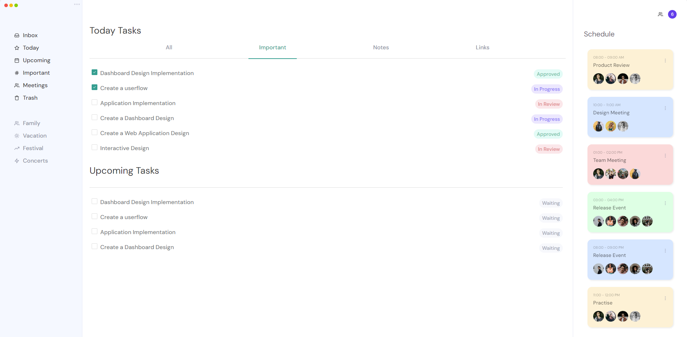

Ứng dụng quản lý công việc là một ứng dụng web đơn giản giúp người dùng theo dõi, quản lý và tổ chức các công việc cá nhân hoặc công việc trong nhóm.

Người thực hiện: 20120344 - Vương Tấn Phát.

Các yêu cầu:
- Lập trình theo kiến trúc MVC → Hoàn thành
- Có template của website → Hoàn thành
- Sử dụng CSS hoặc các thư viện CSS bootstrap để trình bày trang web → Hoàn thành
- Phân trang trong trang xem danh sách công việc → Chưa hoàn thành

Danh sách chức năng:
- Trang 1: Trang chủ
    + Liên kết tới các trang con → Hoàn thành

- Trang 2: Thêm mới công việc
    + Lưu ý: Khi thêm phải kiểm tra dữ liệu bắt buộc phải nhập (javasript) → Hoàn thành

- Trang 3: Xem danh sách công việc / xoá
    + Có ô nhập liệu để tìm kiếm công việc (theo tên và mô tả) để tìm công việc cần thiết. Ngoài ra có thể lọc các các công việc sắp hết hạn, các công việc đã hoàn thành, các công việc đang thực hiện,... 
    + Có thể xem chi tiết công việc ở một trang riêng → Chưa hoàn thành
    + Có thể xoá công việc trong trang xem danh sách → Chưa hoàn thành
    + Có thể chọn nhiều công việc và xoá (sử dụng check box), có thể chọn tất cả công việc để xoá → Chưa hoàn thành
    + Khi xoá phải báo lỗi nếu loại công việc bị tham chiếu bởi công việc → Hoàn thành
    + Có nút để liên kết tới trang cập nhật thông tin công việc → Hoàn thành
    + Cập nhật thay đổi trạng thái công việc trong trang danh sách → Hoàn thành
    + Quản lý danh mục loại công việc → Chưa hoàn thành

- Trang 4: Cập nhật công việc
    + Hiển thị nội dung công việc từ trang 2 khi người dùng chọn cập nhật → Chưa hoàn thành
    + Sau khi cập nhật sẽ quay về trang danh sách công việc → Chưa hoàn thành

Ảnh minh họa:
